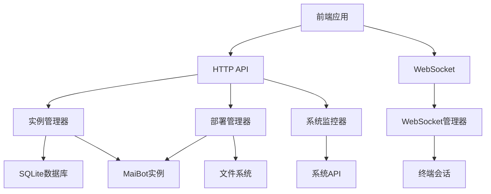
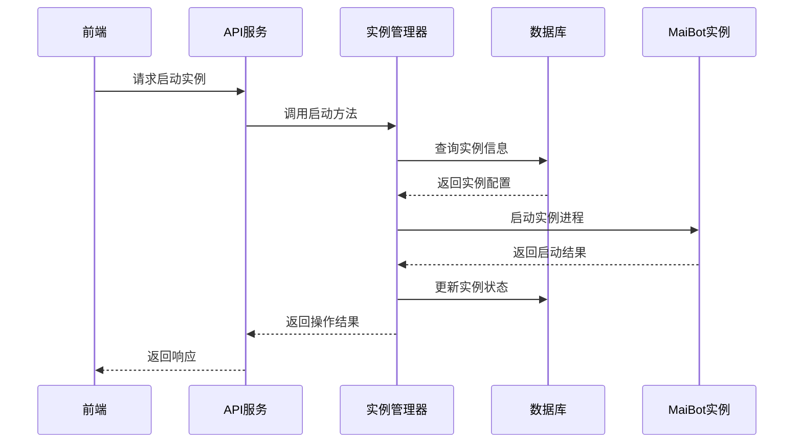
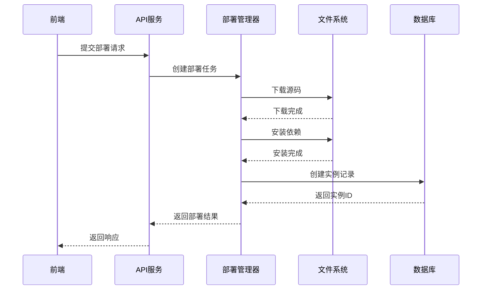
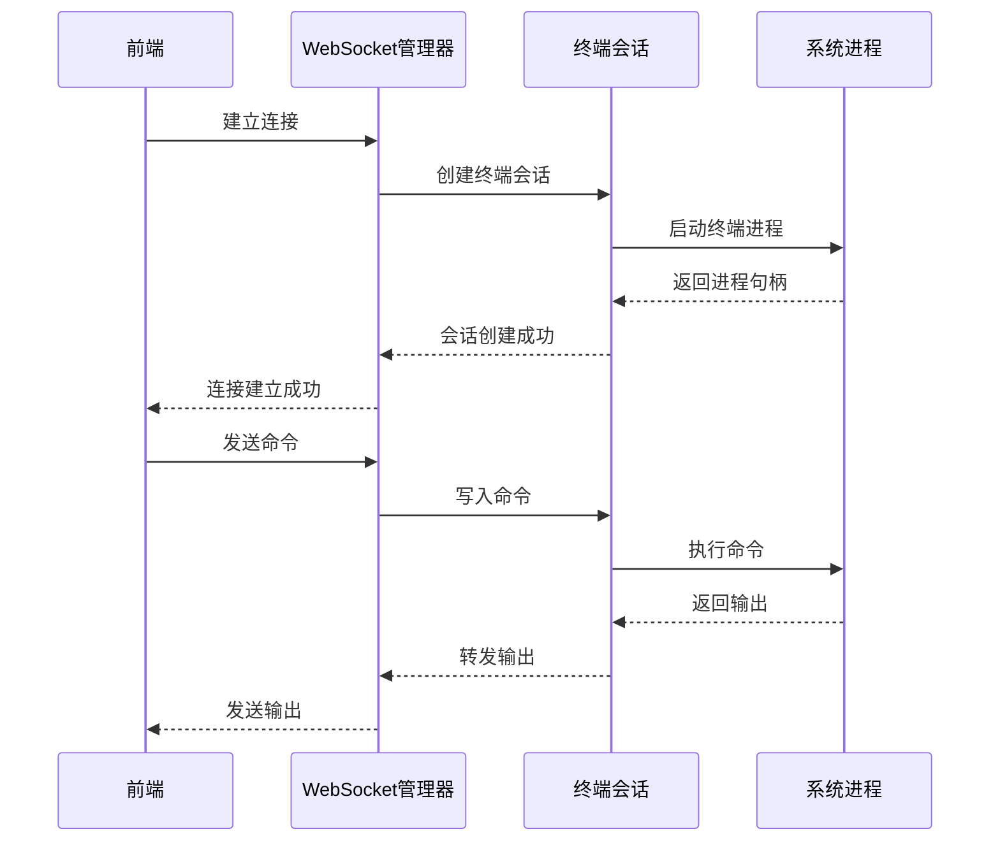

# 项目架构文档

本文档详细描述了 MaiLauncher 的整体架构设计和技术选型。

## 📋 目录

- [系统架构](#系统架构)
- [技术栈](#技术栈)
- [模块设计](#模块设计)
- [数据流](#数据流)
- [安全设计](#安全设计)
- [性能优化](#性能优化)
- [扩展性设计](#扩展性设计)

## 🏗️ 系统架构

### 整体架构

MaiLauncher 采用前后端分离的架构设计，由以下几个主要组件构成：

```
┌─────────────────────────────────────────────────────────────┐
│                    MaiLauncher 系统架构                      │
├─────────────────────────────────────────────────────────────┤
│                                                             │
│  ┌─────────────────┐    ┌─────────────────┐                │
│  │   前端应用       │    │   桌面应用       │                │
│  │   (Web UI)      │    │   (Tauri)       │                │
│  │                 │    │                 │                │
│  │  - Vue 3        │    │  - 原生集成     │                │
│  │  - Vite         │    │  - 系统托盘     │                │
│  │  - Tailwind CSS │    │  - 自动启动     │                │
│  └─────────────────┘    └─────────────────┘                │
│           │                       │                        │
│           └───────────────────────┘                        │
│                       │                                    │
│                   HTTP/WebSocket                           │
│                       │                                    │
│  ┌─────────────────────────────────────────────────────────┤
│  │                  后端服务                                │
│  │                 (FastAPI)                               │
│  │                                                         │
│  │  ┌─────────────┐  ┌─────────────┐  ┌─────────────┐      │
│  │  │ 实例管理器   │  │ 部署管理器   │  │ 系统监控器   │      │
│  │  │             │  │             │  │             │      │
│  │  │ - 生命周期   │  │ - 版本管理   │  │ - 健康检查   │      │
│  │  │ - 状态监控   │  │ - 自动部署   │  │ - 性能监控   │      │
│  │  │ - 服务控制   │  │ - 依赖管理   │  │ - 日志管理   │      │
│  │  └─────────────┘  └─────────────┘  └─────────────┘      │
│  │                                                         │
│  │  ┌─────────────┐  ┌─────────────┐  ┌─────────────┐      │
│  │  │ 资源管理器   │  │ 配置管理器   │  │ WebSocket   │      │
│  │  │             │  │             │  │  管理器     │      │
│  │  │ - 表情包     │  │ - Bot配置    │  │             │      │
│  │  │ - 用户信息   │  │ - LPMM配置   │  │ - 终端会话   │      │
│  │  │ - 文件管理   │  │ - 环境变量   │  │ - 实时通信   │      │
│  │  └─────────────┘  └─────────────┘  └─────────────┘      │
│  │                                                         │
│  └─────────────────────────────────────────────────────────┤
│                                                             │
│  ┌─────────────────────────────────────────────────────────┤
│  │                   数据层                                 │
│  │                                                         │
│  │  ┌─────────────┐  ┌─────────────┐  ┌─────────────┐      │
│  │  │ SQLite 数据库│  │ 文件系统     │  │ 配置文件     │      │
│  │  │             │  │             │  │             │      │
│  │  │ - 实例信息   │  │ - 日志文件   │  │ - 系统配置   │      │
│  │  │ - 用户数据   │  │ - 静态资源   │  │ - 用户偏好   │      │
│  │  │ - 配置数据   │  │ - 缓存数据   │  │ - 运行时设置 │      │
│  │  └─────────────┘  └─────────────┘  └─────────────┘      │
│  │                                                         │
│  └─────────────────────────────────────────────────────────┤
│                                                             │
│  ┌─────────────────────────────────────────────────────────┤
│  │                 MaiBot 实例层                            │
│  │                                                         │
│  │  ┌─────────────┐  ┌─────────────┐  ┌─────────────┐      │
│  │  │ 实例 A       │  │ 实例 B       │  │ 实例 C       │      │
│  │  │             │  │             │  │             │      │
│  │  │ - NapCat    │  │ - NapCat    │  │ - NoneBot   │      │
│  │  │ - NoneBot   │  │ - 自定义服务 │  │ - 插件系统   │      │
│  │  │ - 独立端口   │  │ - 独立配置   │  │ - 数据隔离   │      │
│  │  └─────────────┘  └─────────────┘  └─────────────┘      │
│  │                                                         │
│  └─────────────────────────────────────────────────────────┤
└─────────────────────────────────────────────────────────────┘
```

### 组件交互



## 🛠️ 技术栈

### 前端技术栈

#### 核心框架
- **Vue 3**: 渐进式 JavaScript 框架
  - Composition API: 更好的逻辑复用
  - Reactivity API: 响应式数据管理
  - Teleport: 组件传送门
  - Fragments: 多根节点组件

- **Vite**: 现代化构建工具
  - ES 模块热更新
  - 快速冷启动
  - 优化的构建输出
  - 插件生态系统

#### UI 框架
- **Tailwind CSS**: 实用优先的 CSS 框架
  - 原子化 CSS 类
  - 响应式设计
  - 暗黑模式支持
  - 自定义主题

- **DaisyUI**: 基于 Tailwind CSS 的组件库
  - 预制组件
  - 多主题支持
  - 无 JavaScript 依赖
  - 语义化类名

#### 状态管理
- **Pinia**: Vue 3 状态管理库
  - TypeScript 友好
  - 模块化设计
  - 开发工具支持
  - 插件系统

#### 工具库
- **Iconify**: 图标系统
- **xterm.js**: 终端模拟器
- **ECharts**: 数据可视化
- **Day.js**: 日期处理

#### 桌面应用
- **Tauri**: 跨平台桌面应用框架
  - Rust 后端
  - 安全性优先
  - 体积小巧
  - 原生性能

### 后端技术栈

#### 核心框架
- **FastAPI**: 现代 Python Web 框架
  - 自动 API 文档生成
  - 类型提示支持
  - 高性能异步处理
  - 数据验证

- **Uvicorn**: ASGI 服务器
  - 异步支持
  - 高性能
  - 热重载
  - 生产就绪

#### 数据库
- **SQLite**: 轻量级数据库
  - 无服务器
  - 零配置
  - 跨平台
  - 事务支持

- **SQLAlchemy**: ORM 框架
  - 对象关系映射
  - 查询构建器
  - 连接池
  - 数据库迁移

#### 异步处理
- **asyncio**: Python 异步编程
  - 事件循环
  - 协程支持
  - 并发控制
  - 异步 I/O

#### 工具库
- **Pydantic**: 数据验证
- **python-multipart**: 文件上传
- **websockets**: WebSocket 支持
- **psutil**: 系统监控

### 开发工具

#### 代码质量
- **ESLint**: JavaScript 代码检查
- **Prettier**: 代码格式化
- **Black**: Python 代码格式化
- **mypy**: Python 类型检查

#### 测试工具
- **Vitest**: 前端测试框架
- **pytest**: Python 测试框架
- **Vue Test Utils**: Vue 组件测试

#### 构建工具
- **Vite**: 前端构建
- **PyInstaller**: Python 打包
- **Tauri**: 桌面应用打包

## 🔧 模块设计

### 前端模块

#### 1. 路由系统
```javascript
// src/router/index.js
const routes = [
  {
    path: '/',
    component: HomeView,
    children: [
      { path: 'instances', component: InstancesPanel },
      { path: 'deploy', component: DeployPanel },
      { path: 'monitor', component: MonitorPanel },
      { path: 'settings', component: SettingsPanel }
    ]
  }
];
```

#### 2. 状态管理
```javascript
// src/stores/instances.js
export const useInstancesStore = defineStore('instances', {
  state: () => ({
    instances: [],
    loading: false,
    error: null
  }),
  
  actions: {
    async fetchInstances() {
      this.loading = true;
      try {
        const response = await api.getInstances();
        this.instances = response.instances;
      } catch (error) {
        this.error = error.message;
      } finally {
        this.loading = false;
      }
    }
  }
});
```

#### 3. API 服务
```javascript
// src/services/api.js
class ApiService {
  constructor() {
    this.baseURL = 'http://localhost:23456/api/v1';
  }

  async request(endpoint, options = {}) {
    const url = `${this.baseURL}${endpoint}`;
    const response = await fetch(url, {
      headers: {
        'Content-Type': 'application/json',
        ...options.headers
      },
      ...options
    });
    
    if (!response.ok) {
      throw new Error(`HTTP ${response.status}: ${response.statusText}`);
    }
    
    return response.json();
  }
}
```

### 后端模块

#### 1. 实例管理器
```python
# src/modules/instance_manager.py
class InstanceManager:
    def __init__(self):
        self.instances = {}
        self.db_manager = DatabaseManager()
    
    async def start_instance(self, instance_id: str):
        """启动实例"""
        instance = self.instances.get(instance_id)
        if not instance:
            raise HTTPException(404, "实例不存在")
        
        await instance.start()
        return {"success": True, "message": f"实例 {instance.name} 已启动"}
    
    async def stop_instance(self, instance_id: str):
        """停止实例"""
        instance = self.instances.get(instance_id)
        if not instance:
            raise HTTPException(404, "实例不存在")
        
        await instance.stop()
        return {"success": True, "message": f"实例 {instance.name} 已停止"}
```

#### 2. 部署管理器
```python
# src/modules/deploy_manager.py
class DeployManager:
    def __init__(self):
        self.download_manager = DownloadManager()
        self.install_manager = InstallManager()
    
    async def deploy_instance(self, config: DeployConfig):
        """部署新实例"""
        # 创建部署任务
        task = DeployTask(config)
        
        # 下载源码
        await self.download_manager.download(config.version, config.install_path)
        
        # 安装依赖
        await self.install_manager.install_dependencies(config.install_path)
        
        # 安装服务
        for service in config.services:
            await self.install_manager.install_service(service, config.install_path)
        
        # 创建实例记录
        instance_id = await self.create_instance_record(config)
        
        return {"success": True, "instance_id": instance_id}
```

#### 3. WebSocket 管理器
```python
# src/modules/websocket_manager.py
class WebSocketManager:
    def __init__(self):
        self.connections = {}
        self.terminals = {}
    
    async def connect(self, websocket: WebSocket, session_id: str):
        """建立 WebSocket 连接"""
        await websocket.accept()
        self.connections[session_id] = websocket
        
        # 创建终端会话
        terminal = self.create_terminal_session(session_id)
        self.terminals[session_id] = terminal
        
        # 发送历史日志
        await self.send_history_logs(websocket, session_id)
    
    async def handle_message(self, websocket: WebSocket, session_id: str, message: dict):
        """处理客户端消息"""
        if message["type"] == "input":
            terminal = self.terminals.get(session_id)
            if terminal:
                await terminal.write(message["data"])
```

## 🔄 数据流

### 实例管理数据流



### 部署管理数据流



### WebSocket 数据流



## 🔒 安全设计

### 1. 本地应用安全

由于 MaiLauncher 是本地应用，主要安全考虑：

- **端口绑定**: 仅绑定到 localhost，避免外部访问
- **文件权限**: 限制文件访问权限
- **进程隔离**: 每个实例运行在独立进程中
- **数据验证**: 严格验证所有输入数据

### 2. 文件系统安全

```python
# 路径验证
def validate_path(path: str) -> bool:
    """验证路径安全性"""
    # 禁止路径遍历
    if '..' in path or path.startswith('/'):
        return False
    
    # 限制在工作目录内
    abs_path = os.path.abspath(path)
    work_dir = os.path.abspath(settings.WORK_DIR)
    
    return abs_path.startswith(work_dir)
```

### 3. 进程管理安全

```python
# 进程权限控制
def create_process(command: str, cwd: str) -> subprocess.Popen:
    """创建受限进程"""
    # 设置环境变量
    env = os.environ.copy()
    env['PATH'] = settings.SAFE_PATH
    
    # 创建进程
    process = subprocess.Popen(
        command,
        cwd=cwd,
        env=env,
        stdout=subprocess.PIPE,
        stderr=subprocess.PIPE,
        text=True
    )
    
    return process
```

### 4. 数据库安全

```python
# 参数化查询
def get_instance(instance_id: str) -> Optional[Instance]:
    """安全的数据库查询"""
    query = "SELECT * FROM instances WHERE id = ?"
    result = db.execute(query, (instance_id,)).fetchone()
    return Instance.from_row(result) if result else None
```

## ⚡ 性能优化

### 1. 前端性能优化

#### 代码分割
```javascript
// 路由懒加载
const routes = [
  {
    path: '/instances',
    component: () => import('./views/InstancesView.vue')
  },
  {
    path: '/deploy',
    component: () => import('./views/DeployView.vue')
  }
];
```

#### 组件优化
```vue
<!-- 虚拟滚动 -->
<template>
  <VirtualList
    :items="instances"
    :item-height="80"
    :container-height="400"
  >
    <template #item="{ item }">
      <InstanceCard :instance="item" />
    </template>
  </VirtualList>
</template>
```

#### 状态优化
```javascript
// 计算属性缓存
export const useInstancesStore = defineStore('instances', {
  state: () => ({
    instances: [],
    filter: ''
  }),
  
  getters: {
    filteredInstances: (state) => {
      if (!state.filter) return state.instances;
      return state.instances.filter(instance => 
        instance.name.toLowerCase().includes(state.filter.toLowerCase())
      );
    }
  }
});
```

### 2. 后端性能优化

#### 异步处理
```python
# 并发处理
async def process_instances_batch(instance_ids: List[str]):
    """批量处理实例"""
    tasks = []
    for instance_id in instance_ids:
        task = asyncio.create_task(process_instance(instance_id))
        tasks.append(task)
    
    results = await asyncio.gather(*tasks, return_exceptions=True)
    return results
```

#### 数据库优化
```python
# 连接池
from sqlalchemy.pool import StaticPool

engine = create_engine(
    "sqlite:///mailauncher.db",
    poolclass=StaticPool,
    pool_size=10,
    max_overflow=20
)
```

#### 缓存策略
```python
# 内存缓存
from functools import lru_cache
from typing import Dict, Any

@lru_cache(maxsize=128)
def get_instance_config(instance_id: str) -> Dict[str, Any]:
    """获取实例配置（带缓存）"""
    config_path = f"instances/{instance_id}/config.json"
    with open(config_path, 'r') as f:
        return json.load(f)
```

### 3. 系统资源优化

#### 内存管理
```python
# 定期清理
async def cleanup_resources():
    """清理系统资源"""
    # 清理过期会话
    expired_sessions = []
    for session_id, session in websocket_manager.sessions.items():
        if session.is_expired():
            expired_sessions.append(session_id)
    
    for session_id in expired_sessions:
        await websocket_manager.close_session(session_id)
    
    # 清理临时文件
    temp_dir = Path("temp")
    for file in temp_dir.glob("*"):
        if file.stat().st_mtime < time.time() - 3600:  # 1小时
            file.unlink()
```

## 🔧 扩展性设计

### 1. 插件系统

```python
# 插件接口
class PluginInterface:
    """插件接口"""
    
    def __init__(self, name: str, version: str):
        self.name = name
        self.version = version
    
    async def initialize(self, context: PluginContext):
        """初始化插件"""
        pass
    
    async def on_instance_start(self, instance: Instance):
        """实例启动时触发"""
        pass
    
    async def on_instance_stop(self, instance: Instance):
        """实例停止时触发"""
        pass
    
    def get_routes(self) -> List[APIRoute]:
        """获取插件路由"""
        return []
```

### 2. 配置系统

```python
# 配置管理
class ConfigManager:
    def __init__(self):
        self.config = {}
        self.watchers = []
    
    def load_config(self, config_path: str):
        """加载配置"""
        with open(config_path, 'r') as f:
            self.config = json.load(f)
    
    def get(self, key: str, default=None):
        """获取配置值"""
        keys = key.split('.')
        value = self.config
        
        for k in keys:
            value = value.get(k)
            if value is None:
                return default
        
        return value
    
    def set(self, key: str, value: Any):
        """设置配置值"""
        keys = key.split('.')
        config = self.config
        
        for k in keys[:-1]:
            config = config.setdefault(k, {})
        
        config[keys[-1]] = value
        self.notify_watchers(key, value)
    
    def watch(self, key: str, callback: Callable):
        """监听配置变化"""
        self.watchers.append((key, callback))
```

### 3. 事件系统

```python
# 事件总线
class EventBus:
    def __init__(self):
        self.listeners = defaultdict(list)
    
    def on(self, event: str, callback: Callable):
        """注册事件监听器"""
        self.listeners[event].append(callback)
    
    def off(self, event: str, callback: Callable):
        """移除事件监听器"""
        if callback in self.listeners[event]:
            self.listeners[event].remove(callback)
    
    async def emit(self, event: str, data: Any = None):
        """发布事件"""
        for callback in self.listeners[event]:
            try:
                if asyncio.iscoroutinefunction(callback):
                    await callback(event, data)
                else:
                    callback(event, data)
            except Exception as e:
                logger.error(f"事件处理失败: {e}")
```

### 4. 模块化设计

```python
# 模块注册
class ModuleManager:
    def __init__(self):
        self.modules = {}
    
    def register_module(self, name: str, module: Any):
        """注册模块"""
        self.modules[name] = module
        logger.info(f"模块 {name} 已注册")
    
    def get_module(self, name: str) -> Any:
        """获取模块"""
        return self.modules.get(name)
    
    def load_modules(self, modules_dir: str):
        """加载模块目录"""
        for file in Path(modules_dir).glob("*.py"):
            module_name = file.stem
            spec = importlib.util.spec_from_file_location(module_name, file)
            module = importlib.util.module_from_spec(spec)
            spec.loader.exec_module(module)
            
            if hasattr(module, 'register'):
                module.register(self)
```

## 📊 监控和日志

### 1. 性能监控

```python
# 性能指标收集
class MetricsCollector:
    def __init__(self):
        self.metrics = {}
    
    def record_request(self, endpoint: str, duration: float, status_code: int):
        """记录请求指标"""
        key = f"request_{endpoint}_{status_code}"
        if key not in self.metrics:
            self.metrics[key] = []
        
        self.metrics[key].append({
            'timestamp': time.time(),
            'duration': duration
        })
    
    def get_metrics(self) -> Dict[str, Any]:
        """获取性能指标"""
        return {
            'total_requests': sum(len(values) for values in self.metrics.values()),
            'avg_response_time': self.calculate_avg_response_time(),
            'error_rate': self.calculate_error_rate()
        }
```

### 2. 结构化日志

```python
# 日志配置
import structlog

structlog.configure(
    processors=[
        structlog.stdlib.filter_by_level,
        structlog.stdlib.add_logger_name,
        structlog.stdlib.add_log_level,
        structlog.stdlib.PositionalArgumentsFormatter(),
        structlog.processors.TimeStamper(fmt="iso"),
        structlog.processors.StackInfoRenderer(),
        structlog.processors.format_exc_info,
        structlog.processors.JSONRenderer()
    ],
    context_class=dict,
    logger_factory=structlog.stdlib.LoggerFactory(),
    wrapper_class=structlog.stdlib.BoundLogger,
    cache_logger_on_first_use=True,
)

# 使用结构化日志
logger = structlog.get_logger()

async def start_instance(instance_id: str):
    logger.info(
        "开始启动实例",
        instance_id=instance_id,
        action="start_instance"
    )
    
    try:
        # 启动逻辑
        pass
    except Exception as e:
        logger.error(
            "实例启动失败",
            instance_id=instance_id,
            error=str(e),
            action="start_instance"
        )
        raise
```

这个架构文档详细描述了 MaiLauncher 的系统设计，为开发者提供了全面的技术参考。通过模块化设计、性能优化和扩展性考虑，确保系统能够长期稳定运行并支持未来的功能扩展。
