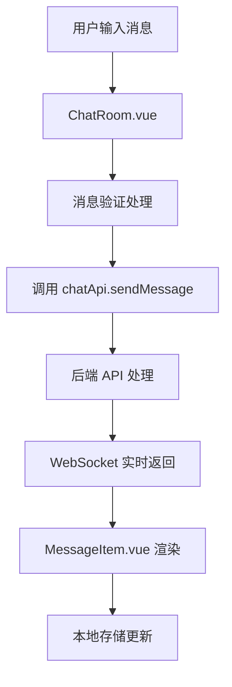

# 前端 send_message 实现开发文档

## 📋 概述

`send_message` 功能是 MaiLauncher 前端聊天系统的核心功能，负责处理用户与 MaiBot 实例的消息交互。本文档详细介绍了该功能的完整实现架构、API 接口、组件设计和最佳实践。

## 🏗️ 架构设计

### 整体架构流程



### 技术栈组成

- **前端框架**: Vue 3 + Composition API
- **HTTP 客户端**: Axios (通过 apiService)
- **实时通信**: WebSocket
- **状态管理**: 响应式数据 + localStorage
- **UI 组件**: DaisyUI + Tailwind CSS
- **图标系统**: Iconify

## 📁 文件结构

```
src/
├── components/
│   └── chat/
│       ├── ChatRoom.vue          # 主聊天界面
│       ├── MessageItem.vue       # 消息项组件
│       └── ChatSidebar.vue       # 聊天侧边栏
├── services/
│   ├── api.js                    # API 接口定义
│   ├── websocket.js              # WebSocket 服务
│   └── toastService.js           # 消息提示服务
└── utils/
    └── api.js                    # API 工具函数
```

## 🔧 核心组件实现

### 1. API 接口层 (api.js)

```javascript
// src/services/api.js
export const chatApi = {
  // 获取指定实例的聊天历史
  getChatHistory: (instanceId) =>
    apiService.get(createUrl(`/chat/${instanceId}/history`)),

  // 发送聊天消息
  sendMessage: (instanceId, message) =>
    apiService.post(createUrl(`/chat/${instanceId}/send`), message),
};
```

**功能说明**:
- `getChatHistory`: 获取实例的历史聊天记录
- `sendMessage`: 发送消息到指定的 MaiBot 实例

**参数规范**:
- `instanceId`: 实例唯一标识符
- `message`: 消息对象，包含内容、类型等信息

### 2. 主聊天组件 (ChatRoom.vue)

#### 组件状态管理

```javascript
// 响应式状态
const input = ref('');              // 输入框内容
const sending = ref(false);         // 发送状态标识
const currentSession = ref(null);   // 当前会话
const messages = ref([]);           // 消息列表
const searchQuery = ref('');        // 搜索关键词
```

#### 核心发送逻辑

```javascript
// 发送消息主函数
async function sendMessage() {
    if (!input.value.trim() || sending.value) return;
    
    const content = input.value.trim();
    input.value = '';
    sending.value = true;
    
    try {
        // 1. 添加用户消息到界面
        const userMessage = {
            id: Date.now(),
            content,
            timestamp: new Date().toISOString(),
            sender: 'user',
            avatar: '/assets/default.png',
            type: 'text',
        };
        messages.value.push(userMessage);
        updateSessionMessages();
        nextTick(scrollToBottom);
        
        // 2. 调用 API 发送消息 (当前版本为模拟实现)
        await simulateStreamingReply(content);
        
    } catch (error) {
        console.error('发送消息失败:', error);
        toastService.error('消息发送失败');
    } finally {
        sending.value = false;
        nextTick(scrollToBottom);
    }
}
```

#### 流式响应处理

```javascript
// 模拟流式AI回复 (未来将替换为真实API调用)
async function simulateStreamingReply(userContent) {
    const reply = '这是AI的流式回复，逐字显示效果。';
    let aiMsg = {
        id: Date.now() + 1,
        content: '',
        timestamp: new Date().toISOString(),
        sender: 'bot',
        avatar: '/assets/icon.ico',
        type: 'text',
        isNew: true
    };
    
    messages.value.push(aiMsg);
    updateSessionMessages();
    
    // 流式输出效果
    for (let i = 0; i < reply.length; i++) {
        aiMsg.content += reply[i];
        messages.value[messages.value.length - 1] = { ...aiMsg };
        await new Promise(r => setTimeout(r, 40));
    }
    
    aiMsg.isNew = false;
    messages.value[messages.value.length - 1] = { ...aiMsg };
    updateSessionMessages();
}
```

### 3. 消息组件 (MessageItem.vue)

#### 消息类型支持

```javascript
// 消息类型判断
const isMarkdown = computed(() => {
    const content = props.message.content;
    return /[`*_#\[\]()>]/.test(content) || content.includes('```');
});

// Markdown 渲染
const renderedContent = computed(() => {
    if (!isMarkdown.value) return props.message.content;

    try {
        marked.setOptions({
            highlight: function (code, lang) {
                if (lang && Prism.languages[lang]) {
                    return Prism.highlight(code, Prism.languages[lang], lang);
                }
                return code;
            },
            breaks: true,
            gfm: true
        });

        return marked.parse(props.message.content);
    } catch (error) {
        console.error('Markdown渲染失败:', error);
        return props.message.content;
    }
});
```

#### 消息操作功能

```javascript
// 编辑消息
function startEdit() {
    isEditing.value = true;
    editContent.value = props.message.content;
}

function saveEdit() {
    if (editContent.value.trim()) {
        emit('edit', {
            messageId: props.message.id,
            newContent: editContent.value.trim()
        });
        isEditing.value = false;
        toastService?.success('消息已更新');
    }
}

// 复制消息
async function copyMessage() {
    try {
        await navigator.clipboard.writeText(props.message.content);
        toastService?.success('已复制到剪贴板');
    } catch (error) {
        console.error('复制失败:', error);
        toastService?.error('复制失败');
    }
}

// 删除消息
function deleteMessage() {
    if (confirm('确定要删除这条消息吗？')) {
        emit('delete', props.message.id);
    }
}
```

## 🌐 WebSocket 通信

### WebSocket 服务类

```javascript
// src/services/websocket.js
export class WebSocketService {
    constructor(url, options = {}) {
        this.url = url;
        this.websocket = null;
        this.connected = false;
        this.eventHandlers = {};
        this.autoReconnect = options.autoReconnect !== false;
        this.maxReconnectAttempts = options.maxReconnectAttempts || 5;
        this.reconnectAttempts = 0;
        this.reconnectDelay = options.reconnectDelay || 3000;
    }

    // 发送消息
    send(data) {
        if (!this.websocket || this.websocket.readyState !== WebSocket.OPEN) {
            console.error("WebSocket未连接，无法发送数据");
            return false;
        }

        try {
            const message = typeof data === "object" ? JSON.stringify(data) : data;
            this.websocket.send(message);
            return true;
        } catch (error) {
            console.error("WebSocket发送数据失败:", error);
            return false;
        }
    }

    // 事件监听
    on(eventName, handler) {
        if (!this.eventHandlers[eventName]) {
            this.eventHandlers[eventName] = [];
        }
        this.eventHandlers[eventName].push(handler);
    }
}
```

### 消息协议规范

#### 发送消息格式

```json
{
    "type": "input",
    "data": "用户输入的消息内容\n"
}
```

#### 接收消息格式

```json
{
    "type": "output",
    "data": "AI回复的消息内容"
}
```

```json
{
    "type": "status",
    "message": "连接状态信息"
}
```

```json
{
    "type": "error",
    "message": "错误信息描述"
}
```

## 💾 数据存储设计

### 消息数据结构

```javascript
const messageSchema = {
    id: Number,                    // 消息唯一ID (时间戳)
    content: String,               // 消息内容
    timestamp: String,             // ISO 格式时间戳
    sender: 'user' | 'bot',       // 发送者类型
    avatar: String,                // 头像URL
    type: 'text' | 'image',       // 消息类型
    isNew: Boolean,                // 是否为新消息 (用于流式效果)
}
```

### 会话数据结构

```javascript
const sessionSchema = {
    id: String,                    // 会话唯一ID
    title: String,                 // 会话标题
    instanceId: String,            // 关联的实例ID
    messages: Array,               // 消息数组
    messageCount: Number,          // 消息数量
    createdAt: String,             // 创建时间
    updatedAt: String,             // 更新时间
}
```

### 本地存储实现

```javascript
// 保存会话到本地存储
function saveSessionsToStorage() {
    localStorage.setItem('mai-chat-sessions', JSON.stringify(chatSessions.value));
}

// 从本地存储加载会话
function loadSessionsFromStorage() {
    try {
        const stored = localStorage.getItem('mai-chat-sessions');
        if (stored) {
            chatSessions.value = JSON.parse(stored);
        }
    } catch (error) {
        console.error('加载本地会话失败:', error);
        chatSessions.value = [];
    }
}
```

## 🎨 用户界面设计

### 响应式布局

```vue
<template>
    <div class="chat-room-layout flex h-screen">
        <!-- 侧边栏 -->
        <div class="w-80 border-r border-base-200 animated-sidebar">
            <ChatSidebar 
                ref="sidebarRef"
                @session-selected="handleSessionSelected"
                @new-chat="handleNewChat"
            />
        </div>
        
        <!-- 主聊天区域 -->
        <div class="flex-1 flex flex-col animated-main-chat">
            <!-- 聊天头部 -->
            <div class="chat-top-bar">
                <!-- 头部内容 -->
            </div>
            
            <!-- 消息显示区域 -->
            <div class="flex-1 overflow-y-auto px-8 py-6" ref="chatBody">
                <MessageItem 
                    v-for="msg in filteredMessages" 
                    :key="msg.id" 
                    :message="msg"
                    :instanceName="currentSession?.title"
                    @edit="handleEditMessage"
                    @delete="handleDeleteMessage"
                    @regenerate="handleRegenerateMessage"
                />
            </div>
            
            <!-- 输入区域 -->
            <div class="chat-input-area px-6 py-4 border-t border-base-200">
                <div class="flex gap-2 items-end max-w-2xl mx-auto">
                    <input 
                        ref="inputRef" 
                        v-model="input" 
                        @keydown.enter.exact.prevent="sendMessage"
                        type="text"
                        class="input input-bordered flex-1"
                        placeholder="输入消息..."
                        :disabled="sending"
                    />
                    <button 
                        class="btn btn-primary btn-circle" 
                        @click="sendMessage" 
                        :disabled="sending || !input.trim()"
                    >
                        <Icon icon="mdi:send" width="22" height="22" />
                    </button>
                </div>
            </div>
        </div>
    </div>
</template>
```

### 动画效果

```css
/* 消息进入动画 */
.animated-message {
    animation: messageSlideIn 0.3s ease-out;
}

@keyframes messageSlideIn {
    from {
        opacity: 0;
        transform: translateY(20px);
    }
    to {
        opacity: 1;
        transform: translateY(0);
    }
}

/* 流式输出动画 */
.typing-dots span {
    width: 0.375rem;
    height: 0.375rem;
    background-color: hsl(var(--p));
    border-radius: 50%;
    animation: typing 1.4s infinite ease-in-out;
}

@keyframes typing {
    0%, 80%, 100% {
        transform: scale(0.8);
        opacity: 0.5;
    }
    40% {
        transform: scale(1);
        opacity: 1;
    }
}
```

## 🔧 错误处理机制

### API 错误处理

```javascript
// 在 sendMessage 中的错误处理
try {
    const response = await chatApi.sendMessage(instanceId, messageData);
    
    if (!response.success) {
        throw new Error(response.message || '发送失败');
    }
    
    // 处理成功响应
    handleSuccessResponse(response.data);
    
} catch (error) {
    console.error('发送消息失败:', error);
    
    // 显示用户友好的错误信息
    if (error.response?.status === 404) {
        toastService.error('实例不存在或已离线');
    } else if (error.response?.status === 500) {
        toastService.error('服务器内部错误，请稍后重试');
    } else {
        toastService.error(error.message || '消息发送失败');
    }
    
    // 恢复用户输入
    input.value = originalContent;
}
```

### WebSocket 错误处理

```javascript
// WebSocket 连接错误处理
websocket.onerror = (event) => {
    console.error("WebSocket错误:", event);
    this.triggerEvent("error", event);
    
    // 显示连接错误提示
    toastService.error('实时连接中断，正在尝试重连...');
};

// WebSocket 关闭处理
websocket.onclose = (event) => {
    console.log("WebSocket连接已关闭:", event);
    this.connected = false;
    this.triggerEvent("close", event);
    
    // 自动重连机制
    if (this.autoReconnect && this.reconnectAttempts < this.maxReconnectAttempts) {
        this.reconnectAttempts++;
        console.log(`尝试重连 (${this.reconnectAttempts}/${this.maxReconnectAttempts})`);
        
        setTimeout(() => {
            this.connect();
        }, this.reconnectDelay);
    }
};
```

## 🚀 性能优化

### 消息列表虚拟化

```javascript
// 大量消息时的性能优化
const VISIBLE_MESSAGE_COUNT = 50;

const visibleMessages = computed(() => {
    const totalMessages = filteredMessages.value.length;
    if (totalMessages <= VISIBLE_MESSAGE_COUNT) {
        return filteredMessages.value;
    }
    
    // 只渲染最新的50条消息
    return filteredMessages.value.slice(-VISIBLE_MESSAGE_COUNT);
});
```

### 防抖输入处理

```javascript
import { debounce } from 'lodash-es';

// 搜索防抖
const debouncedSearch = debounce((query) => {
    searchQuery.value = query;
}, 300);

// 在模板中使用
@input="debouncedSearch($event.target.value)"
```

### 图片懒加载

```javascript
// 图片消息懒加载
const imageObserver = new IntersectionObserver((entries) => {
    entries.forEach((entry) => {
        if (entry.isIntersecting) {
            const img = entry.target;
            img.src = img.dataset.src;
            imageObserver.unobserve(img);
        }
    });
});

// 注册观察器
onMounted(() => {
    const images = document.querySelectorAll('img[data-src]');
    images.forEach(img => imageObserver.observe(img));
});
```

## 🧪 测试策略

### 单元测试

```javascript
// tests/components/ChatRoom.test.js
import { mount } from '@vue/test-utils';
import ChatRoom from '@/components/chat/ChatRoom.vue';

describe('ChatRoom.vue', () => {
    it('应该能够发送消息', async () => {
        const wrapper = mount(ChatRoom);
        const input = wrapper.find('input');
        const sendButton = wrapper.find('button[data-testid="send-button"]');
        
        await input.setValue('测试消息');
        await sendButton.trigger('click');
        
        expect(wrapper.vm.messages).toHaveLength(1);
        expect(wrapper.vm.messages[0].content).toBe('测试消息');
    });
    
    it('应该禁止发送空消息', async () => {
        const wrapper = mount(ChatRoom);
        const sendButton = wrapper.find('button[data-testid="send-button"]');
        
        await sendButton.trigger('click');
        
        expect(wrapper.vm.messages).toHaveLength(0);
    });
});
```

### 集成测试

```javascript
// tests/integration/chat.integration.test.js
import { createApp } from 'vue';
import { chatApi } from '@/services/api.js';

describe('聊天功能集成测试', () => {
    beforeEach(() => {
        // 模拟 API 响应
        jest.spyOn(chatApi, 'sendMessage').mockResolvedValue({
            success: true,
            data: { id: 1, content: 'AI回复' }
        });
    });
    
    it('应该完整地处理消息发送流程', async () => {
        // 测试完整的发送流程
        const result = await chatApi.sendMessage('test-instance', {
            content: '测试消息',
            type: 'text'
        });
        
        expect(result.success).toBe(true);
        expect(chatApi.sendMessage).toHaveBeenCalledWith('test-instance', {
            content: '测试消息',
            type: 'text'
        });
    });
});
```


## 🔮 未来规划

### 待实现功能

1. **真实 API 集成**: 替换模拟实现为真实的后端 API 调用
2. **文件上传**: 支持图片、文档等文件发送
3. **消息搜索**: 全文搜索和高级筛选
4. **离线支持**: PWA 和离线消息缓存

### 技术改进

1. **状态管理**: 迁移到 Pinia 进行全局状态管理
2. **测试覆盖**: 提高单元测试和集成测试覆盖率
3. **性能监控**: 集成性能监控和错误追踪

---

📝 本文档将随着功能开发持续更新，如有疑问请提交 Issue 或 Pull Request。
