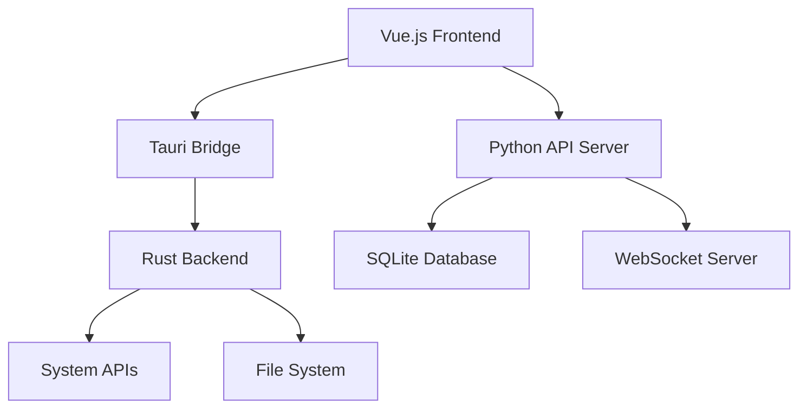

# 开发文档

欢迎来到 MaiLauncher 开发文档！本文档面向希望参与 MaiLauncher 开发或了解其技术架构的开发者。

## 🎯 项目概述

MaiLauncher 是一个功能强大的 MaiBot 实例管理和部署工具，采用现代化的前后端分离架构。

### 前端技术栈 (mailauncher)
- **框架**: Vue 3 + Composition API
- **UI 库**: DaisyUI + Tailwind CSS
- **构建工具**: Vite
- **状态管理**: Pinia
- **图标**: Iconify
- **终端**: xterm.js
- **图表**: ECharts
- **跨平台**: Tauri

### 后端技术栈 (mailauncher-backend)
- **框架**: FastAPI
- **数据库**: SQLite + SQLAlchemy
- **异步**: asyncio
- **服务器**: Uvicorn
- **WebSocket**: 原生支持
- **日志**: 结构化日志系统

## 🏗️ 项目结构

### 前端项目结构

```
mailauncher/
├── src/
│   ├── App.vue                 # 主应用组件
│   ├── main.js                # 应用入口
│   ├── components/            # Vue组件
│   │   ├── AppSidebar.vue     # 侧边栏
│   │   ├── HomeView.vue       # 主页视图
│   │   ├── InstancesPanel.vue # 实例管理面板
│   │   ├── DownloadsPanel.vue # 下载中心
│   │   ├── chat/              # 聊天相关组件
│   │   ├── downloads/         # 下载中心组件
│   │   ├── instances/         # 实例管理组件
│   │   └── settings/          # 设置相关组件
│   ├── services/              # 服务层
│   │   ├── apiService.js      # API 服务
│   │   ├── websocket.js       # WebSocket 服务
│   │   ├── toastService.js    # 通知服务
│   │   └── theme.js           # 主题服务
│   ├── stores/                # Pinia状态管理
│   │   ├── instanceStore.js   # 实例状态
│   │   ├── deployStore.js     # 部署状态
│   │   └── systemStore.js     # 系统状态
│   ├── utils/                 # 工具函数
│   │   ├── formatters.js      # 格式化工具
│   │   └── apiAdapters.js     # API适配器
│   └── assets/                # 静态资源
├── src-tauri/                 # Tauri配置
│   ├── Cargo.toml
│   ├── tauri.conf.json
│   └── src/
└── public/                    # 公共资源
```

### 后端项目结构

```
mailauncher-backend/
├── main.py                    # FastAPI应用入口
├── config.toml               # 配置文件
├── src/
│   ├── modules/              # 核心功能模块
│   │   ├── deploy_api.py     # 部署API
│   │   ├── instance_api.py   # 实例API
│   │   ├── instance_manager.py # 实例管理器
│   │   ├── maibot_api.py     # MaiBot API
│   │   ├── maibot_res_manager.py # 资源管理器
│   │   ├── messages_api.py   # 消息API
│   │   ├── system.py         # 系统API
│   │   └── websocket_manager.py # WebSocket管理器
│   ├── tools/                # 辅助工具
│   │   └── deploy_version.py # 版本部署工具
│   └── utils/                # 通用工具
│       ├── config.py         # 配置管理
│       ├── database_model.py # 数据模型
│       ├── database.py       # 数据库操作
│       ├── logger.py         # 日志系统
│       └── server.py         # 服务器工具
├── data/                     # 数据目录
│   └── MaiLauncher.db        # SQLite数据库
└── logs/                     # 日志目录
├── src-tauri/             # Tauri 配置和 Rust 代码
│   ├── src/               # Rust 源码
│   ├── capabilities/      # Tauri 权限配置
│   └── resources/         # 资源文件
├── mailauncher-backend/   # Python 后端
│   ├── src/               # 后端源码
│   ├── data/              # 数据文件
│   └── logs/              # 日志文件
└── docs/                  # 文档源码
```

## 开发环境搭建

### 前置要求

1. **Node.js**：版本 16 或更高
2. **Python**：版本 3.8 或更高
3. **Rust**：最新稳定版
4. **Git**：用于版本控制

### 克隆项目

```bash
# 克隆主项目
git clone https://github.com/MaiM-with-u/mailauncher.git
cd mailauncher

# 克隆后端项目
git clone https://github.com/MaiM-with-u/mailauncher-backend.git

# 克隆文档项目
git clone https://github.com/MaiM-with-u/Mailauncher-docs.git
```

### 安装依赖

#### 前端依赖
```bash
cd mailauncher
npm install
```

#### 后端依赖
```bash
cd mailauncher-backend
pip install -r requirements.txt
```

### 开发模式运行

#### 启动后端服务
```bash
cd mailauncher-backend
python main.py
```

#### 启动前端开发服务器
```bash
cd mailauncher
npm run dev
```

## 技术架构

### 架构图



### 核心模块

#### 1. 前端模块
- **启动器界面**：游戏管理和启动界面
- **设置面板**：应用配置和偏好设置
- **实例管理**：游戏实例的创建和管理
- **日志查看器**：应用和游戏日志查看

#### 2. Tauri 桥接层
- **系统集成**：与操作系统的深度集成
- **文件操作**：安全的文件系统访问
- **进程管理**：游戏进程的启动和监控
- **窗口管理**：应用窗口的控制

#### 3. Python 后端
- **API 服务**：RESTful API 提供
- **数据库管理**：数据持久化和查询
- **WebSocket 服务**：实时通信支持
- **游戏管理**：游戏实例和配置管理

## 开发指南

### 代码规范

#### JavaScript/Vue.js
- 使用 ESLint + Prettier 进行代码格式化
- 遵循 Vue.js 官方风格指南
- 使用 Composition API
- 组件命名使用 PascalCase

#### Python
- 遵循 PEP 8 代码规范
- 使用 Black 进行代码格式化
- 函数和变量使用 snake_case
- 类名使用 PascalCase

#### Rust
- 遵循 Rust 官方代码规范
- 使用 rustfmt 进行格式化
- 使用 clippy 进行代码检查

### Git 工作流

我们使用 Git Flow 工作流：

1. **main 分支**：稳定发布版本
2. **develop 分支**：开发集成分支
3. **feature/** 分支：新功能开发
4. **hotfix/** 分支：紧急修复
5. **release/** 分支：发布准备

### 提交规范

使用 Conventional Commits 规范：

```
<type>[optional scope]: <description>

[optional body]

[optional footer(s)]
```

类型包括：
- `feat`：新功能
- `fix`：错误修复
- `docs`：文档更新
- `style`：代码格式
- `refactor`：代码重构
- `test`：测试相关
- `chore`：构建过程或辅助工具变动

## 贡献指南

### 参与贡献

1. Fork 项目到你的 GitHub 账户
2. 创建功能分支：`git checkout -b feature/amazing-feature`
3. 提交你的修改：`git commit -m 'feat: add amazing feature'`
4. 推送到分支：`git push origin feature/amazing-feature`
5. 创建 Pull Request

### 代码审查

所有代码修改都需要通过 Pull Request 进行：

1. **自动检查**：CI/CD 流水线自动运行测试
2. **代码审查**：至少一位维护者审查代码
3. **测试验证**：确保新功能正常工作
4. **文档更新**：更新相关文档

### 问题报告

报告问题时请提供：

1. **环境信息**：操作系统、软件版本等
2. **重现步骤**：详细的重现步骤
3. **期望行为**：你期望的正确行为
4. **实际行为**：实际发生的错误行为
5. **日志信息**：相关的错误日志

## 发布流程

### 版本号规范

遵循 [Semantic Versioning](https://semver.org/)：

- **主版本号**：不兼容的 API 修改
- **次版本号**：向后兼容的功能性新增
- **修订号**：向后兼容的问题修正

### 发布步骤

1. **代码冻结**：创建 release 分支
2. **版本测试**：完整的功能和回归测试
3. **文档更新**：更新 CHANGELOG 和文档
4. **构建打包**：创建各平台的安装包
5. **发布标记**：创建 Git 标签和 GitHub Release
6. **部署分发**：发布到各个分发渠道

## 相关链接

- [项目结构](./structure.md) - 详细的项目结构说明
- [构建部署](./build.md) - 构建和部署指南
- [贡献指南](./contributing.md) - 详细的贡献指南
- [API 参考](../api/) - API 文档
