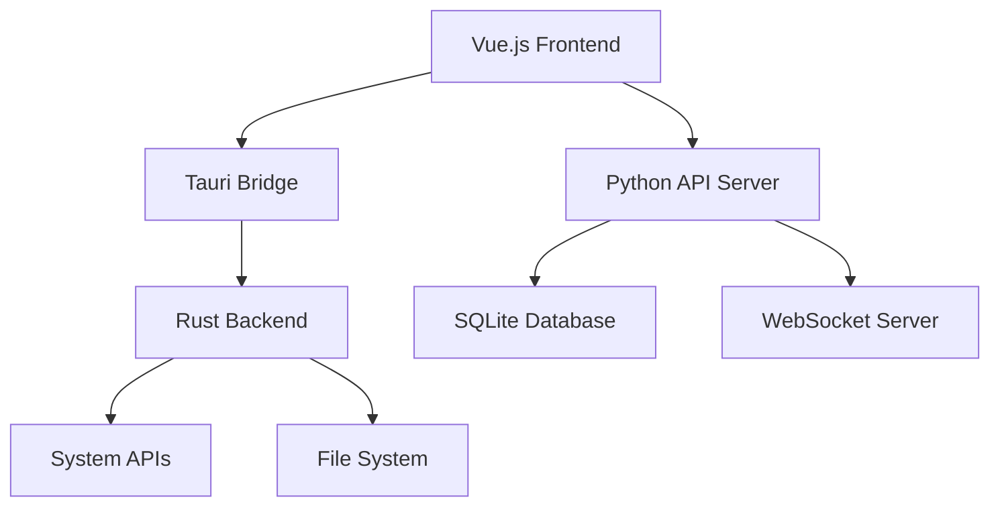

# 开发文档

欢迎来到 MaiLauncher 开发文档！本文档面向希望参与 MaiLauncher 开发或了解其技术架构的开发者。

## 🎯 项目概述

MaiLauncher 是一个功能强大的 MaiBot 实例管理和部署工具，采用现代化的前后端分离架构。

### 前端技术栈 (mailauncher)
- **框架**: Vue 3 + Composition API
- **UI 库**: DaisyUI + Tailwind CSS
- **构建工具**: Vite
- **状态管理**: Pinia
- **图标**: Iconify
- **终端**: xterm.js
- **图表**: ECharts
- **跨平台**: Tauri

### 后端技术栈 (mailauncher-backend)
- **框架**: FastAPI
- **数据库**: SQLite + SQLAlchemy
- **异步**: asyncio
- **服务器**: Uvicorn
- **WebSocket**: 原生支持
- **日志**: 结构化日志系统

## 📚 文档导航

### 🏗️ [项目架构](./architecture.md)
了解 MaiLauncher 的整体系统架构、技术选型和设计理念：
- 系统架构图
- 技术栈详解
- 模块设计
- 数据流分析
- 安全设计
- 性能优化
- 扩展性设计

### 🚀 [部署指南](./deployment.md)
完整的部署指南，覆盖从开发到生产的各种环境：
- 开发环境部署
- 生产环境部署
- 容器化部署
- 自动化部署
- 监控和维护
- 故障排除

### 🤝 [贡献指南](./contributing.md)
参与项目开发的完整指南：
- 开发环境设置
- 代码规范
- 提交规范
- Pull Request 流程
- 问题报告
- 文档贡献
- 社区准则

### 📱 [前端开发指南](./frontend-sendmessage.md)
前端特定功能的开发说明：
- 消息发送功能
- 组件开发
- 状态管理
- API 集成

### ⚙️ [CI/CD 配置](./github-actions.md)
自动化构建和部署配置：
- GitHub Actions 配置
- 自动化测试
- 构建流程
- 部署流程

## 🏗️ 项目结构

### 前端项目结构

```
mailauncher/
├── src/
│   ├── App.vue                 # 主应用组件
│   ├── main.js                # 应用入口
│   ├── components/            # Vue组件
│   │   ├── AppSidebar.vue     # 侧边栏
│   │   ├── HomeView.vue       # 主页视图
│   │   ├── InstancesPanel.vue # 实例管理面板
│   │   ├── DownloadsPanel.vue # 下载中心
│   │   ├── chat/              # 聊天相关组件
│   │   ├── downloads/         # 下载中心组件
│   │   ├── instances/         # 实例管理组件
│   │   └── settings/          # 设置相关组件
│   ├── services/              # 服务层
│   │   ├── apiService.js      # API 服务
│   │   ├── websocket.js       # WebSocket 服务
│   │   ├── toastService.js    # 通知服务
│   │   └── theme.js           # 主题服务
│   ├── stores/                # Pinia状态管理
│   │   ├── instances.js       # 实例状态
│   │   ├── downloads.js       # 下载状态
│   │   ├── settings.js        # 设置状态
│   │   └── chat.js           # 聊天状态
│   ├── utils/                 # 工具函数
│   │   ├── helpers.js         # 通用助手
│   │   ├── validators.js      # 数据验证
│   │   └── constants.js       # 常量定义
│   ├── composables/           # Vue组合式函数
│   │   ├── useInstances.js    # 实例管理
│   │   ├── useWebSocket.js    # WebSocket管理
│   │   └── useTheme.js        # 主题管理
│   └── assets/                # 静态资源
│       ├── styles/            # 样式文件
│       ├── images/            # 图片资源
│       └── icons/             # 图标资源
├── src-tauri/                 # Tauri配置
│   ├── src/                   # Rust源码
│   ├── Cargo.toml            # Rust依赖
│   └── tauri.conf.json       # Tauri配置
├── public/                    # 公共资源
├── package.json              # 项目配置
├── vite.config.ts            # Vite配置
├── tailwind.config.js        # Tailwind配置
└── tsconfig.json             # TypeScript配置
```

### 后端项目结构

```
mailauncher-backend/
├── main.py                    # 应用入口
├── src/
│   ├── modules/               # 功能模块
│   │   ├── instance_api.py    # 实例管理API
│   │   ├── deploy_api.py      # 部署管理API
│   │   ├── system.py          # 系统监控API
│   │   ├── maibot_api.py      # MaiBot资源API
│   │   ├── messages_api.py    # 消息管理API
│   │   └── websocket_manager.py # WebSocket管理
│   ├── utils/                 # 工具类
│   │   ├── database.py        # 数据库操作
│   │   ├── database_model.py  # 数据模型
│   │   ├── logger.py          # 日志管理
│   │   ├── server.py          # 服务器配置
│   │   └── config.py          # 配置管理
│   └── tools/                 # 辅助工具
│       └── deploy_version.py  # 部署版本管理
├── data/                      # 数据目录
│   └── MaiLauncher.db        # SQLite数据库
├── logs/                      # 日志目录
├── assets/                    # 静态资源
├── requirements.txt           # Python依赖
├── requirements-cross-platform.txt # 跨平台依赖
└── version_info.txt          # 版本信息
```

## 🚀 快速开始

### 1. 环境准备

确保您的开发环境满足以下要求：

- **Python 3.8+** - 后端开发
- **Node.js 16+** - 前端开发
- **Git** - 版本控制
- **VSCode** - 推荐IDE（可选）

### 2. 克隆项目

```bash
# 克隆前端项目
git clone https://github.com/your-org/mailauncher.git
cd mailauncher

# 克隆后端项目
git clone https://github.com/your-org/mailauncher-backend.git
```

### 3. 后端开发环境

```bash
cd mailauncher-backend

# 创建虚拟环境
python -m venv venv

# 激活虚拟环境 (Windows)
venv\Scripts\activate
# 激活虚拟环境 (macOS/Linux)
source venv/bin/activate

# 安装依赖
pip install -r requirements.txt

# 初始化数据库
python -c "from src.utils.database import init_database; init_database()"

# 启动开发服务器
python main.py
```

### 4. 前端开发环境

```bash
cd mailauncher

# 安装依赖
npm install
# 或使用 pnpm (推荐)
pnpm install

# 启动开发服务器
npm run dev
# 或使用 pnpm
pnpm dev
```

### 5. 验证安装

- 后端服务: http://localhost:23456
- 前端应用: http://localhost:5173
- API 文档: http://localhost:23456/docs

## 🔧 开发工具

### 推荐的开发工具

1. **代码编辑器**
   - VSCode (推荐)
   - PyCharm
   - WebStorm

2. **API 测试**
   - Postman
   - Insomnia
   - curl

3. **数据库管理**
   - SQLite Browser
   - DBeaver
   - DataGrip

4. **版本控制**
   - Git
   - GitHub Desktop
   - SourceTree

### VSCode 扩展推荐

```json
{
  "recommendations": [
    "ms-python.python",
    "ms-python.black-formatter",
    "vue.volar",
    "bradlc.vscode-tailwindcss",
    "esbenp.prettier-vscode",
    "dbaeumer.vscode-eslint",
    "ms-vscode.vscode-typescript-next"
  ]
}
```

## 📊 开发流程

### 1. 功能开发流程


### 2. 代码质量保证

- **代码规范**: 使用 Black (Python) 和 Prettier (JavaScript)
- **静态分析**: 使用 flake8, mypy (Python) 和 ESLint (JavaScript)  
- **单元测试**: pytest (Python) 和 Vitest (JavaScript)
- **集成测试**: API 测试和端到端测试
- **代码审查**: 所有代码都需要经过 Pull Request 审查

### 3. 提交规范

使用 [Conventional Commits](https://www.conventionalcommits.org/) 规范：

```
<type>(<scope>): <description>

[optional body]

[optional footer(s)]
```

示例：
```bash
feat(backend): 添加实例批量操作 API
fix(frontend): 修复实例状态显示问题
docs: 更新 API 文档
```

## 🧪 测试策略

### 后端测试

```bash
cd mailauncher-backend

# 运行所有测试
pytest

# 运行特定测试文件
pytest tests/test_instance_api.py

# 运行带覆盖率的测试
pytest --cov=src tests/

# 运行性能测试
pytest tests/performance/
```

### 前端测试

```bash
cd mailauncher

# 运行单元测试
pnpm test

# 运行带覆盖率的测试
pnpm test:coverage

# 运行端到端测试
pnpm test:e2e

# 运行组件测试
pnpm test:component
```

## 🐛 调试指南

### 后端调试

1. **使用 Python 调试器**
```python
import pdb; pdb.set_trace()  # 设置断点
```

2. **查看日志**
```bash
tail -f logs/mailauncher.log
```

3. **使用 FastAPI 调试模式**
```python
# main.py
if __name__ == "__main__":
    uvicorn.run("main:app", host="0.0.0.0", port=23456, reload=True, debug=True)
```

### 前端调试

1. **浏览器开发者工具**
   - Console 查看日志
   - Network 查看API请求
   - Vue DevTools 查看组件状态

2. **Vite 热重载**
   - 代码更改自动刷新
   - 保持应用状态

3. **调试配置**
```javascript
// vite.config.js
export default {
  define: {
    __VUE_OPTIONS_API__: true,
    __VUE_PROD_DEVTOOLS__: true
  }
}
```

## 📈 性能优化

### 后端性能

- **异步处理**: 使用 async/await
- **数据库优化**: 索引和查询优化
- **缓存策略**: 内存缓存关键数据
- **并发控制**: 限制并发请求数

### 前端性能

- **代码分割**: 按路由分割代码
- **懒加载**: 组件和图片懒加载
- **虚拟滚动**: 大列表优化
- **缓存策略**: API 响应缓存

## 🔐 安全考虑

### 后端安全

- **输入验证**: 严格验证所有输入
- **SQL 注入防护**: 使用参数化查询
- **文件访问控制**: 限制文件访问权限
- **进程隔离**: 实例进程隔离

### 前端安全

- **XSS 防护**: 输出转义
- **CSRF 防护**: 使用 CSRF 令牌
- **内容安全策略**: CSP 头部配置
- **依赖安全**: 定期更新依赖

## 📞 获取帮助

如果您在开发过程中遇到问题，可以通过以下方式获取帮助：

1. **查看文档**: 首先查看相关文档
2. **搜索 Issues**: 在 GitHub 上搜索类似问题
3. **创建 Issue**: 描述问题并提供复现步骤
4. **社区讨论**: 参与社区讨论
5. **联系维护者**: 直接联系项目维护者

## 🎯 路线图

### 近期目标 (v1.1)
- [ ] 实例模板系统
- [ ] 插件管理器
- [ ] 性能监控面板
- [ ] 多语言支持

### 中期目标 (v1.5)
- [ ] 集群管理
- [ ] 自动扩缩容
- [ ] 高级监控
- [ ] API 认证

### 长期目标 (v2.0)
- [ ] 微服务架构
- [ ] 云原生部署
- [ ] 企业级功能
- [ ] 第三方集成

---

感谢您对 MaiLauncher 项目的关注！如果您有任何建议或想法，欢迎通过 GitHub Issues 或 Pull Requests 与我们分享。
│   │   ├── instanceStore.js   # 实例状态
│   │   ├── deployStore.js     # 部署状态
│   │   └── systemStore.js     # 系统状态
│   ├── utils/                 # 工具函数
│   │   ├── formatters.js      # 格式化工具
│   │   └── apiAdapters.js     # API适配器
│   └── assets/                # 静态资源
├── src-tauri/                 # Tauri配置
│   ├── Cargo.toml
│   ├── tauri.conf.json
│   └── src/
└── public/                    # 公共资源
```

### 后端项目结构

```
mailauncher-backend/
├── main.py                    # FastAPI应用入口
├── config.toml               # 配置文件
├── src/
│   ├── modules/              # 核心功能模块
│   │   ├── deploy_api.py     # 部署API
│   │   ├── instance_api.py   # 实例API
│   │   ├── instance_manager.py # 实例管理器
│   │   ├── maibot_api.py     # MaiBot API
│   │   ├── maibot_res_manager.py # 资源管理器
│   │   ├── messages_api.py   # 消息API
│   │   ├── system.py         # 系统API
│   │   └── websocket_manager.py # WebSocket管理器
│   ├── tools/                # 辅助工具
│   │   └── deploy_version.py # 版本部署工具
│   └── utils/                # 通用工具
│       ├── config.py         # 配置管理
│       ├── database_model.py # 数据模型
│       ├── database.py       # 数据库操作
│       ├── logger.py         # 日志系统
│       └── server.py         # 服务器工具
├── data/                     # 数据目录
│   └── MaiLauncher.db        # SQLite数据库
└── logs/                     # 日志目录
├── src-tauri/             # Tauri 配置和 Rust 代码
│   ├── src/               # Rust 源码
│   ├── capabilities/      # Tauri 权限配置
│   └── resources/         # 资源文件
├── mailauncher-backend/   # Python 后端
│   ├── src/               # 后端源码
│   ├── data/              # 数据文件
│   └── logs/              # 日志文件
└── docs/                  # 文档源码
```

## 开发环境搭建

### 前置要求

1. **Node.js**：版本 16 或更高
2. **Python**：版本 3.8 或更高
3. **Rust**：最新稳定版
4. **Git**：用于版本控制

### 克隆项目

```bash
# 克隆主项目
git clone https://github.com/MaiM-with-u/mailauncher.git
cd mailauncher

# 克隆后端项目
git clone https://github.com/MaiM-with-u/mailauncher-backend.git

# 克隆文档项目
git clone https://github.com/MaiM-with-u/Mailauncher-docs.git
```

### 安装依赖

#### 前端依赖
```bash
cd mailauncher
npm install
```

#### 后端依赖
```bash
cd mailauncher-backend
pip install -r requirements.txt
```

### 开发模式运行

#### 启动后端服务
```bash
cd mailauncher-backend
python main.py
```

#### 启动前端开发服务器
```bash
cd mailauncher
npm run dev
```

## 技术架构

### 架构图



### 核心模块

#### 1. 前端模块
- **启动器界面**：游戏管理和启动界面
- **设置面板**：应用配置和偏好设置
- **实例管理**：游戏实例的创建和管理
- **日志查看器**：应用和游戏日志查看

#### 2. Tauri 桥接层
- **系统集成**：与操作系统的深度集成
- **文件操作**：安全的文件系统访问
- **进程管理**：游戏进程的启动和监控
- **窗口管理**：应用窗口的控制

#### 3. Python 后端
- **API 服务**：RESTful API 提供
- **数据库管理**：数据持久化和查询
- **WebSocket 服务**：实时通信支持
- **游戏管理**：游戏实例和配置管理

## 开发指南

### 代码规范

#### JavaScript/Vue.js
- 使用 ESLint + Prettier 进行代码格式化
- 遵循 Vue.js 官方风格指南
- 使用 Composition API
- 组件命名使用 PascalCase

#### Python
- 遵循 PEP 8 代码规范
- 使用 Black 进行代码格式化
- 函数和变量使用 snake_case
- 类名使用 PascalCase

#### Rust
- 遵循 Rust 官方代码规范
- 使用 rustfmt 进行格式化
- 使用 clippy 进行代码检查

### Git 工作流

我们使用 Git Flow 工作流：

1. **main 分支**：稳定发布版本
2. **develop 分支**：开发集成分支
3. **feature/** 分支：新功能开发
4. **hotfix/** 分支：紧急修复
5. **release/** 分支：发布准备

### 提交规范

使用 Conventional Commits 规范：

```
<type>[optional scope]: <description>

[optional body]

[optional footer(s)]
```

类型包括：
- `feat`：新功能
- `fix`：错误修复
- `docs`：文档更新
- `style`：代码格式
- `refactor`：代码重构
- `test`：测试相关
- `chore`：构建过程或辅助工具变动

## 贡献指南

### 参与贡献

1. Fork 项目到你的 GitHub 账户
2. 创建功能分支：`git checkout -b feature/amazing-feature`
3. 提交你的修改：`git commit -m 'feat: add amazing feature'`
4. 推送到分支：`git push origin feature/amazing-feature`
5. 创建 Pull Request

### 代码审查

所有代码修改都需要通过 Pull Request 进行：

1. **自动检查**：CI/CD 流水线自动运行测试
2. **代码审查**：至少一位维护者审查代码
3. **测试验证**：确保新功能正常工作
4. **文档更新**：更新相关文档

### 问题报告

报告问题时请提供：

1. **环境信息**：操作系统、软件版本等
2. **重现步骤**：详细的重现步骤
3. **期望行为**：你期望的正确行为
4. **实际行为**：实际发生的错误行为
5. **日志信息**：相关的错误日志

## 发布流程

### 版本号规范

遵循 [Semantic Versioning](https://semver.org/)：

- **主版本号**：不兼容的 API 修改
- **次版本号**：向后兼容的功能性新增
- **修订号**：向后兼容的问题修正

### 发布步骤

1. **代码冻结**：创建 release 分支
2. **版本测试**：完整的功能和回归测试
3. **文档更新**：更新 CHANGELOG 和文档
4. **构建打包**：创建各平台的安装包
5. **发布标记**：创建 Git 标签和 GitHub Release
6. **部署分发**：发布到各个分发渠道

## 相关链接

- [项目结构](./structure.md) - 详细的项目结构说明
- [构建部署](./build.md) - 构建和部署指南
- [贡献指南](./contributing.md) - 详细的贡献指南
- [前端 send_message 实现](./frontend-sendmessage.md) - 聊天功能开发文档
- [GitHub Actions 部署](./github-actions.md) - 自动化部署配置
- [API 参考](../api/) - API 文档
