# 开发文档

欢迎来到 MaiLauncher 开发文档！本文档面向希望参与 MaiLauncher 开发或了解其技术架构的开发者。

## 🎯 项目概述

MaiLauncher 是一个功能强大的 MaiBot 实例管理和部署工具，采用现代化的前后端分离架构。

### 前端技术栈 (mailauncher)
- **框架**: Vue 3 + Composition API
- **UI 库**: DaisyUI + Tailwind CSS
- **构建工具**: Vite
- **状态管理**: Pinia
- **图标**: Iconify
- **终端**: xterm.js
- **图表**: ECharts
- **跨平台**: Tauri

### 后端技术栈 (mailauncher-backend)
- **框架**: FastAPI
- **数据库**: SQLite + SQLAlchemy
- **异步**: asyncio
- **服务器**: Uvicorn
- **WebSocket**: 原生支持
- **日志**: 结构化日志系统

## 📚 文档导航

### 🏗️ [项目架构](./architecture.md)
了解 MaiLauncher 的整体系统架构、技术选型和设计理念：
- 系统架构图
- 技术栈详解
- 模块设计
- 数据流分析
- 安全设计
- 性能优化
- 扩展性设计

### 🚀 [部署指南](./deployment.md)
完整的部署指南，覆盖从开发到生产的各种环境：
- 开发环境部署
- 生产环境部署
- 容器化部署
- 自动化部署
- 监控和维护
- 故障排除

### 🤝 [贡献指南](./contributing.md)
参与项目开发的完整指南：
- 开发环境设置
- 代码规范
- 提交规范
- Pull Request 流程
- 问题报告
- 文档贡献
- 社区准则

### 📱 [前端开发指南](./frontend-sendmessage.md)
前端特定功能的开发说明：
- 消息发送功能
- 组件开发
- 状态管理
- API 集成

### ⚙️ [CI/CD 配置](./github-actions.md)
自动化构建和部署配置：
- GitHub Actions 配置
- 自动化测试
- 构建流程
- 部署流程

## 🏗️ 项目结构

### 前端项目结构

```
mailauncher/
├── src/
│   ├── App.vue                 # 主应用组件
│   ├── main.js                # 应用入口
│   ├── components/            # Vue组件
│   │   ├── AppSidebar.vue     # 侧边栏
│   │   ├── HomeView.vue       # 主页视图
│   │   ├── InstancesPanel.vue # 实例管理面板
│   │   ├── DownloadsPanel.vue # 下载中心
│   │   ├── chat/              # 聊天相关组件
│   │   ├── downloads/         # 下载中心组件
│   │   ├── instances/         # 实例管理组件
│   │   └── settings/          # 设置相关组件
│   ├── services/              # 服务层
│   │   ├── apiService.js      # API 服务
│   │   ├── websocket.js       # WebSocket 服务
│   │   ├── toastService.js    # 通知服务
│   │   └── theme.js           # 主题服务
│   ├── stores/                # Pinia状态管理
│   │   ├── instances.js       # 实例状态
│   │   ├── downloads.js       # 下载状态
│   │   ├── settings.js        # 设置状态
│   │   └── chat.js           # 聊天状态
│   ├── utils/                 # 工具函数
│   │   ├── helpers.js         # 通用助手
│   │   ├── validators.js      # 数据验证
│   │   └── constants.js       # 常量定义
│   ├── composables/           # Vue组合式函数
│   │   ├── useInstances.js    # 实例管理
│   │   ├── useWebSocket.js    # WebSocket管理
│   │   └── useTheme.js        # 主题管理
│   └── assets/                # 静态资源
│       ├── styles/            # 样式文件
│       ├── images/            # 图片资源
│       └── icons/             # 图标资源
├── src-tauri/                 # Tauri配置
│   ├── src/                   # Rust源码
│   ├── Cargo.toml            # Rust依赖
│   └── tauri.conf.json       # Tauri配置
├── public/                    # 公共资源
├── package.json              # 项目配置
├── vite.config.ts            # Vite配置
├── tailwind.config.js        # Tailwind配置
└── tsconfig.json             # TypeScript配置
```

### 后端项目结构

```
mailauncher-backend/
├── main.py                    # 应用入口
├── src/
│   ├── modules/               # 功能模块
│   │   ├── instance_api.py    # 实例管理API
│   │   ├── deploy_api.py      # 部署管理API
│   │   ├── system.py          # 系统监控API
│   │   ├── maibot_api.py      # MaiBot资源API
│   │   ├── messages_api.py    # 消息管理API
│   │   └── websocket_manager.py # WebSocket管理
│   ├── utils/                 # 工具类
│   │   ├── database.py        # 数据库操作
│   │   ├── database_model.py  # 数据模型
│   │   ├── logger.py          # 日志管理
│   │   ├── server.py          # 服务器配置
│   │   └── config.py          # 配置管理
│   └── tools/                 # 辅助工具
│       └── deploy_version.py  # 部署版本管理
├── data/                      # 数据目录
│   └── MaiLauncher.db        # SQLite数据库
├── logs/                      # 日志目录
├── assets/                    # 静态资源
├── requirements.txt           # Python依赖
├── requirements-cross-platform.txt # 跨平台依赖
└── version_info.txt          # 版本信息
```

## 🚀 快速开始

### 1. 环境准备

确保您的开发环境满足以下要求：

- **Python 3.8+** - 后端开发
- **Node.js 16+** - 前端开发
- **Git** - 版本控制
- **VSCode** - 推荐IDE（可选）

### 2. 克隆项目

```bash
# 克隆前端项目
git clone https://github.com/your-org/mailauncher.git
cd mailauncher

# 克隆后端项目
git clone https://github.com/your-org/mailauncher-backend.git
```

### 3. 后端开发环境

```bash
cd mailauncher-backend

# 创建虚拟环境
python -m venv venv

# 激活虚拟环境 (Windows)
venv\Scripts\activate
# 激活虚拟环境 (macOS/Linux)
source venv/bin/activate

# 安装依赖
pip install -r requirements.txt

# 启动开发服务器
python main.py
```

### 4. 前端开发环境

```bash
cd mailauncher

# 安装依赖
npm install
# 或使用 pnpm (推荐)
pnpm install

# 启动开发服务器
npm run dev
# 或使用 pnpm
pnpm dev
```

### 5. 验证安装

- 后端服务: http://localhost:23456
- 前端应用: http://localhost:5173
- API 文档: http://localhost:23456/docs


## 📊 开发流程

### 1. 功能开发流程

```mermaid
graph LR
    A[需求分析] --> B[设计方案]
    B --> C[创建分支]
    C --> D[编写代码]
    D --> E[单元测试]
    E --> F[集成测试]
    F --> G[代码审查]
    G --> H[合并主分支]
    H --> I[部署测试]
```



### 2. 提交规范

使用 [Conventional Commits](https://www.conventionalcommits.org/) 规范：

```
<type>(<scope>): <description>

[optional body]

[optional footer(s)]
```

示例：
```bash
feat(backend): 添加实例批量操作 API
fix(frontend): 修复实例状态显示问题
docs: 更新 API 文档
```


---

感谢您对 MaiLauncher 项目的关注！如果您有任何建议或想法，欢迎通过 GitHub Issues 或 Pull Requests 与我们分享。  
